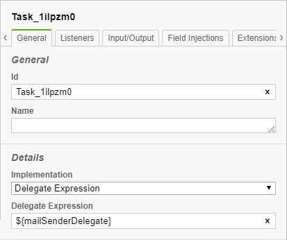

# ART-BPMS-MAILING

ART-BPMS-MAILING is a java module providing possibility to send emails using SMTP from a [Camunda] process.

## Features

* Sending emails using SMTP
* Attaching images to an email if they are in the email template
* Simple SMTP authentication (aka SMTP AUTH)
* TLS connection to SMTP server through STARTTLS

## Getting Started

1. Open your project's pom
2. Add a reference to the artezio mvn repository:
    ```xml
    <repository>
        <id>artezio</id>
        <url>https://nexus.artezio.net/repository/maven-releases</url>
    </repository>
    ```
2. Add the dependency:
    ```xml
    <dependency>
        <groupId>com.artezio.bpm.camunda</groupId>
        <artifactId>camunda-mailing</artifactId>
        <version>${camunda-mailing.version}</version>
    </dependency>
    ``` 

### Setup `java.mail.Session`

`com.artezio.bpm.camunda.mailing.MailSenderDelegate` service looks for the session with JNDI `java:global/camunda-bpm-platform/mail/com.artezio.bpm.camunda`
so use this name in your session's settings to make it visible to the service.
For exact `java.mail.Session` setup steps (as a container resource or a standalone object) see corresponding documentation.   

### Usage

For processing/generating mail templates [Apache FreeMarker] library is used. All you need to start working with ART-BPMS-MAILING is
to create mail templates and add them to a process deployment, add a task implemented by the service and start the process.

Detailed steps: 
1. Create mail templates for message's subject and body using the following naming formats: `{template_name}_subject.ftl`
and `{template_name}_body.ftl` (see [FreeMarker guide] for information about creating templates). If you use images in email you should
provide the names of the images in `mailImageNames` environment variable (see [Process variables](#process-variables) section). 
2. Add created templates to a process deployment
3. On a process's diagram put either `Service Task` or `Send Task` component with `Delegate Expression` implementation
4. Select the put component and write `${mailSenderDelegate}` into field `Delegate Expression`<br/>


## Security
### Authentication

`com.artezio.bpm.camunda.mailing.MailSenderDelegate` uses simple SMTP authentication. By default the authentication is turned off.
To force the service to do the authentication you have to specify `SMTP_PASSWORD` variable (see [Environment variables](#environment-variables) section).

### Secured connection

`com.artezio.bpm.camunda.mailing.MailSenderDelegate` allows to establish a TLS connection through STARTTLS extension to SMTP. By
default it is disabled, to make it enabled set `STARTTLS` environment variable to `true` (see [Environment variables](#environment-variables) section).

## Process variables

* `mailSender` - an email sender name, section `From` of an email. Required variable.
* `mailRecipients` - an email recipient list, section `To` of an email. Required variable.
* `mailCcRecipients` - 'copy' email recipient list, section `Cc` of an email. Optional variable.
* `mailBccRecipients` - 'blind copy' email recipient list, section `Bcc` of an email. Optional variable.
* `mailTemplate` - a full path to an email template without `_subject.ftl` and `_body.ftl` suffixes. Required variable.
* `mailImageNames` - the list of the full paths to images used in an email. Optional variable. 

## Environment variables

* `SMTP_HOST` - the url to an SMTP server. Default: `localhost`
* `SMTP_PORT` - the port of SMTP server. Default: `25000`
* `SMTP_USERNAME` - the name of a user for the authentication on SMTP server. Default: ``
* `SMTP_PASSWORD` - the password of a user for the authentication on SMTP server. Default: ``<br/>
* `STARTTLS` - the flag which indicates whether TLS is enabled or not. It allows the using of TLS through [STARTTLS extension]. Default: `false`

[Apache FreeMarker]: https://freemarker.apache.org/
[Camunda]: https://camunda.com/
[FreeMarker guide]: https://freemarker.apache.org/docs/dgui_quickstart.html
[STARTTLS extension]: https://tools.ietf.org/html/rfc3207

